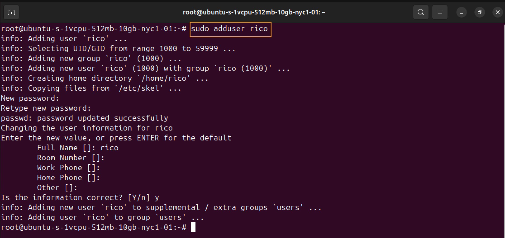
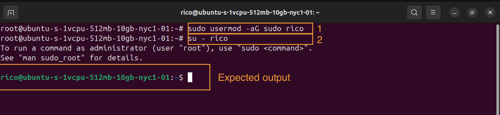
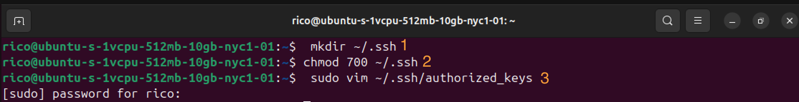
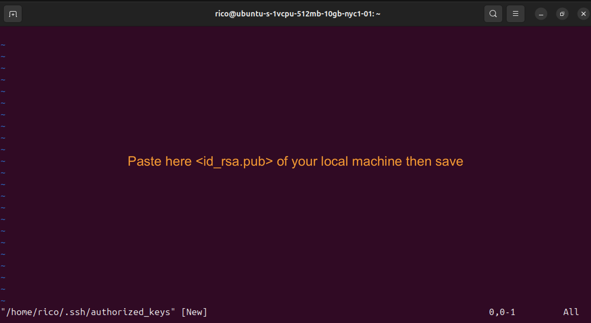
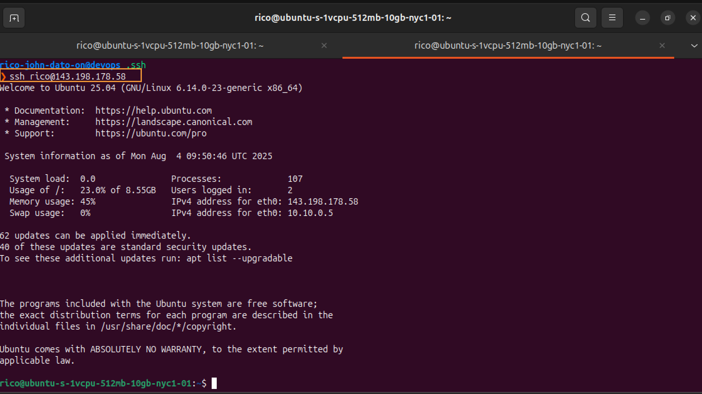

# 🔐 Linux User Management for Secure Server Administration

## 📋 Overview

This guide walks through best practices for Linux server security by managing users and permissions. Instead of running services and applications as the **root** user, we will create individual users for each application and grant them only necessary permissions.

---

## ⚙️ Why Avoid Root for Applications?

- **Security Risk**: Applications with root privileges can access or modify anything.
- **Best Practice**: Create a user for each application.
- **Controlled Access**: Assign only the required permissions.
- **Auditing**: Track user-specific actions.

---

## 🧑‍💻 Create a New Linux User

```bash
# Create a new user named 'rico'
sudo adduser rico

# Set a password for the user - (optional if you forgot to type a new password in the creation of the new user)
sudo passwd rico
```



### Add User to Sudo Group and Switch to new user

- Add New User

```bash
# Give 'rico' sudo privileges
sudo usermod -aG sudo rico
```

- Switch to New User

```bash
# Switch from root to rico user
su - rico
```



---

## 🔑 Setup SSH Access for New User

### Steps

1. **Create `.ssh` directory to the new user created**:

   ```bash
   mkdir ~/.ssh
   chmod 700 ~/.ssh
   ```

2. **Create `authorized_keys` file**:

   ```bash
   sudo vim ~/.ssh/authorized_keys
   ```



3. **Paste your public SSH key** into the file and save.



4. **Exit root and SSH into server with rico**:

   ```bash
   ssh rico@your-server-ip
   ```



---

## 🚀 Application-specific Users

| Application | User     |
| ----------- | -------- |
| Nexus       | nexus    |
| Jenkins     | jenkins  |
| PostgreSQL  | postgres |
| Custom App  | app_user |

> **Note**: Always run applications using their dedicated users.

---

## 📚 References

- [DigitalOcean SSH Key Setup](https://www.digitalocean.com/docs/ssh/create-ssh-keys/)
- [Linux User Management](https://linuxize.com/post/how-to-create-a-sudo-user-on-ubuntu/)
- [Securing Linux Servers](https://www.cyberciti.biz/tips/linux-security.html)

---

## 🛡️ Summary

✅ Avoid root for services  
✅ Use SSH keys for authentication  
✅ Grant only required permissions  
✅ Monitor and audit user actions

---

🧑‍💻 _Created by Rico John Dato-on_
🔗 [LinkedIn](https://www.linkedin.com/in/rico-john-dato-on) • [Portfolio](https://ricodatoon.netlify.app)
